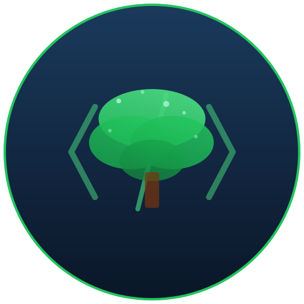

<p align="center">
  <picture>
    <source srcset="public/logo.svg" media="(prefers-color-scheme: dark)">
    
  </picture>
</p>
<p align="center"><strong>Canopy</strong> — Fork do OpenCode com melhorias em estabilidade e DX.</p>
<p align="center">
  <a href="https://github.com/mateussiqueira/canopy"></a>
  <a href="https://github.com/mateussiqueira/canopy/blob/dev/LICENSE"></a>
</p>

---

Fork do [OpenCode](https://github.com/anomalyco/opencode) focado em:

- **Overflow recovery** — Sessões longas não matam o contexto
- **Memória** — RSS menor em sessões com muitas tool calls
- **Segurança** — Proteção contra delete acidental de arquivos
- **Extended thinking** — Suporte a Bedrock Converse

## Instalação

```bash
# Via script
curl -fsSL https://canopy.dev/install | bash

# Do zero
git clone https://github.com/mateussiqueira/canopy.git
cd canopy
bun install
bun run build
```

## Uso

```bash
canopy                    # inicia no diretório atual
canopy /path/to/project   # abre projeto específico
```

## Desenvolvimento

```bash
bun install
bun run dev
```

## Testes

```bash
bun run test              # unitários
bun run test:e2e          # e2e com Playwright
```

## Estrutura

```
packages/
├── core/         # Lógica principal (agent, session, tools)
├── llm/          # Client LLM (providers, streaming)
├── opencode/     # CLI/TUI
├── app/          # Web UI
└── ui/           # Componentes
```

## License

[MIT](LICENSE)
