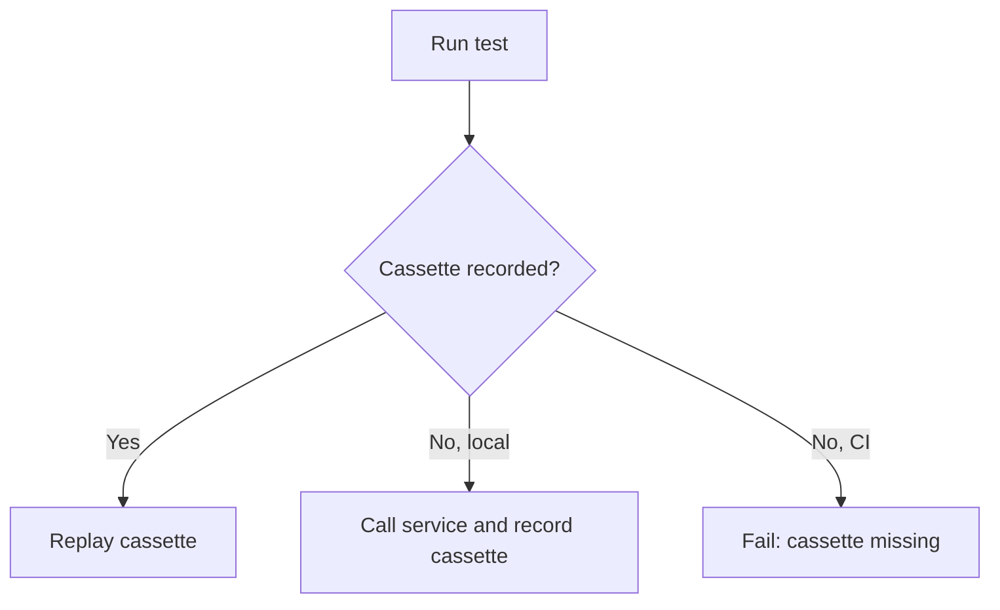

# @opencode-ai/http-recorder

Record real Effect HTTP and WebSocket traffic once, then replay it from deterministic JSON cassettes.

Use it for provider integrations, retries, polling, multi-step flows, and any test where hand-written HTTP mocks hide too much of the real request shape.

> Public beta. The API depends on Effect 4 beta and may change with Effect's unstable transport modules.

## Install

```sh
bun add effect@4.0.0-beta.83 @effect/platform-node@4.0.0-beta.83
bun add -d @opencode-ai/http-recorder@beta @effect/vitest vitest
```

The package supports Node.js 22+ and Bun. It is not intended for browsers, workers, or Deno.

Effect `4.0.0-beta.83` currently contains unresolved symbols in its published declarations. Until those upstream declarations are fixed, TypeScript consumers need:

```json
{
  "compilerOptions": {
    "skipLibCheck": true
  }
}
```

## Quick Start

```ts
import { assert, describe, it } from "@effect/vitest"
import { Effect, Schema } from "effect"
import { HttpClient, HttpClientRequest } from "effect/unstable/http"
import { HttpRecorder } from "@opencode-ai/http-recorder"

const User = Schema.Struct({
  id: Schema.Number,
  name: Schema.String,
})

const getUser = Effect.gen(function* () {
  const http = yield* HttpClient.HttpClient
  const response = yield* http.execute(HttpClientRequest.get("https://jsonplaceholder.typicode.com/users/1"))
  return yield* Schema.decodeUnknownEffect(User)(yield* response.json)
})

describe("getUser", () => {
  it.effect("loads a user", () =>
    Effect.gen(function* () {
      const user = yield* getUser

      assert.strictEqual(user.id, 1)
      assert.strictEqual(user.name, "Leanne Graham")
    }).pipe(Effect.provide(HttpRecorder.http("users/get-one"))),
  )
})
```

Run the test with Vitest. The first local run calls the real API and records:

```sh
bunx vitest run users.test.ts
```

```text
test/fixtures/recordings/users/get-one.json
```

Later runs replay that cassette without contacting the upstream server. When `CI=true`, missing cassettes fail instead of recording.



Application code does not need to know whether a response is live or replayed.

## API

```ts
HttpRecorder.http(name, options?)
HttpRecorder.socket(name, options?)
```

That is the complete public API. `http` provides a fetch-backed recorded `HttpClient`. `socket` decorates a standard Effect `Socket.Socket` supplied beneath it.

## WebSockets

Effect models a WebSocket as a `Socket.Socket` service. A program obtains a scoped `writer` for outgoing frames and runs one receive loop for the lifetime of a connection. The application supplies the live URL-bound socket; the recorder decorates that service without owning its URL, protocols, authentication, timeout, or close policy.

The cassette name is the connection identity during replay. Replay does not validate the live URL or handshake configuration.

```ts
import { it } from "@effect/vitest"
import { NodeSocket } from "@effect/platform-node"
import { Effect, Layer } from "effect"
import { Socket } from "effect/unstable/socket"
import { HttpRecorder } from "@opencode-ai/http-recorder"

const conversation = Effect.gen(function* () {
  const socket = yield* Socket.Socket
  const write = yield* socket.writer

  yield* socket.runString((message) =>
    Effect.gen(function* () {
      const event: unknown = JSON.parse(message)

      if (typeof event !== "object" || event === null || !("type" in event)) return
      if (event.type === "session.created") {
        yield* write(JSON.stringify({ type: "response.create", prompt: "hello" }))
      }
      if (event.type === "response.completed") {
        yield* write(new Socket.CloseEvent(1000, "done"))
      }
    }),
  )
})

const recordedSocket = HttpRecorder.socket("provider/conversation").pipe(
  Layer.provide(
    NodeSocket.layerWebSocket("wss://provider.example/realtime", {
      closeCodeIsError: (code) => code !== 1000,
    }),
  ),
)

it.effect("completes a provider conversation", () => conversation.pipe(Effect.scoped, Effect.provide(recordedSocket)))
```

`socket.runString` owns the receive loop and finishes when the connection closes or fails. Its optional `onOpen` effect is the safe place to send protocols whose client speaks first. The writer is scoped because sending is valid only while a connection run is active.

WebSocket cassettes preserve one ordered transcript of client and server text or binary frames. Replay releases recorded server frames until it reaches a client frame, waits for the application to write the matching frame, then continues. This preserves causal ordering without reproducing network timing.

Client text frames containing JSON compare canonically, so object-key order does not matter. Changed fields, extra fields, non-JSON text, and binary frames must match exactly after redaction. There is intentionally no custom WebSocket matcher in this beta.

Incoming frame handlers start in recorded order and may run concurrently, matching Effect's socket abstraction. Replay waits for all handlers before the socket run completes, but handler completion order is not guaranteed. Use Effect synchronization such as `Queue`, `Ref`, or `Deferred` instead of unsynchronized mutable state.

A cassette is written only after the live socket opened and its run completed successfully. Failed, interrupted, unopened, or invalid runs do not produce a recording. During replay, closing before every recorded frame is consumed fails the test.

The application owns the WebSocket URL and protocols through normal Effect layer wiring. Provide separate recorder and live socket layers for separate endpoints or concurrent connections. One recorder layer supports sequential reconnects, but rejects concurrent runs.

Text frames use the same JSON-field and body redaction as HTTP bodies. Binary frames are stored losslessly as base64. Client and server frame kinds must match during replay.

## Refresh A Cassette

Delete exactly the recordings you want to replace, then rerun their tests:

```sh
rm test/fixtures/recordings/users/get-one.json
bun run test users.test.ts
```

There is intentionally no public overwrite mode. Deletion makes the set of recordings being refreshed visible and reviewable.

## Redaction

Secure defaults remove most headers and redact common credentials in headers, URLs, and JSON bodies. Extend those defaults at layer construction:

```ts
HttpRecorder.http("anthropic/messages", {
  redact: {
    headers: ["x-project-token"],
    allowRequestHeaders: ["anthropic-version"],
    queryParameters: ["session-id"],
    jsonFields: ["user_id"],
    url: (url) => url.replace(/\/accounts\/[^/]+/, "/accounts/{account}"),
    body: (body) => body.replaceAll(/usr_[a-z0-9]+/g, "usr_redacted"),
  },
})
```

| Option                 | Purpose                                                              |
| ---------------------- | -------------------------------------------------------------------- |
| `headers`              | Add sensitive header names. They are retained as `[REDACTED]`.       |
| `allowRequestHeaders`  | Preserve additional non-sensitive request headers for matching.      |
| `allowResponseHeaders` | Preserve additional non-sensitive response headers for replay.       |
| `queryParameters`      | Add sensitive URL query parameter names.                             |
| `jsonFields`           | Recursively redact matching JSON keys in requests and responses.     |
| `url`                  | Stabilize a URL after built-in redaction.                            |
| `body`                 | Stabilize request and response bodies after built-in JSON redaction. |

Before writing, the recorder scans the complete cassette for common credential formats and values from credential-like environment variables. Unsafe cassettes fail without replacing an existing recording.

Redaction is defense in depth, not a substitute for review. Inspect cassette diffs before committing them.

## Matching And Ordering

A cassette contains an ordered sequence of interactions. The first runtime request is checked against the first recorded request, the second against the second, and so on.

This strict ordering correctly models repeated identical requests whose responses change, including retries, polling, and cache tests. JSON object keys are canonicalized before matching.

Concurrent requests are recorded in request-start order even when their responses complete out of order.

Supply a custom equivalence rule when a request contains intentionally volatile data:

```ts
HttpRecorder.http("events/create", {
  match: (incoming, recorded) =>
    incoming.method === recorded.method && new URL(incoming.url).pathname === new URL(recorded.url).pathname,
})
```

## Configuration

```ts
interface RecorderOptions {
  readonly directory?: string
  readonly metadata?: Record<string, unknown>
  readonly redact?: RedactOptions
  readonly match?: RequestMatcher
}

type SocketRecorderOptions = Omit<RecorderOptions, "match">
```

`directory` defaults to `<cwd>/test/fixtures/recordings`.

## Cassettes

Cassettes are readable JSON files intended to be committed with your tests. HTTP interactions are stored in request order. WebSocket cassettes preserve the observed order of client and server frames. Text stays readable; binary bodies and frames are stored losslessly as base64.

## Current Limits

- Responses are buffered while recording and replaying, so this beta is not suitable for tests that assert streaming timing, cancellation, or backpressure.
- WebSocket replay preserves frame chronology and content, not real network timing or backpressure.
- WebSocket V1 cassettes do not reproduce terminal close codes, close reasons, handshake configuration, or transport failures. Failed and interrupted live runs are not recorded.
- WebSocket transcripts are retained in memory until the connection finishes; avoid using this beta for unbounded sessions.
- The package currently requires the exact Effect beta listed above.
- Cassette format version `1` has no migration tooling yet.

## License

MIT
